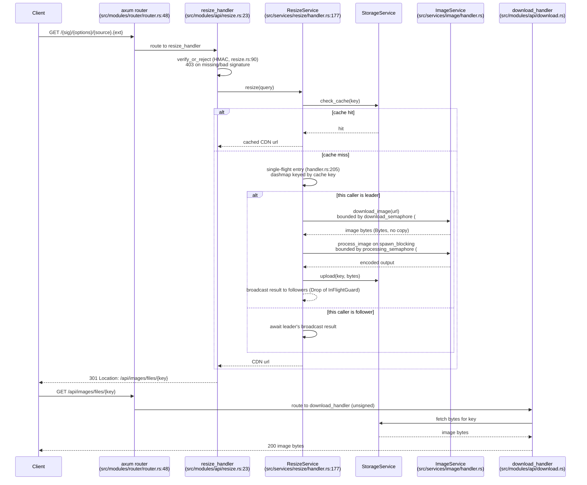

# EmgR — Image Resizing Service

EmgR is an imgproxy-compatible, on-the-fly image resizing service written in Rust (Axum + Tokio). It fetches a source image, decodes/resizes/encodes it per an HMAC-signed URL, caches the result to a storage backend, and 301-redirects the caller to the cached bytes.

It aims to be a credible, self-hosted alternative to [imgproxy](https://imgproxy.net/) — see the [Performance](#performance) section below for an honest, measured comparison against imgproxy v4.0.13, not a marketing claim.

## URL shape

Requests use imgproxy's signed-path grammar, not query parameters:

```
GET /{signature}/{processing_options}/{plain|base64 source}.{extension}
```

- **`{signature}`** — base64url HMAC-SHA256 over the rest of the path, keyed by `SIGNING_KEY`/`SIGNING_SALT` — or the literal `unsigned` when `ALLOW_UNSIGNED_REQUESTS=true`. Signing is the default, not opt-in.
- **`{processing_options}`** — zero or more `/`-delimited `code:args` segments, e.g. `rs:fill:300:300` (resize/crop), `q:80` (quality), `bl:5` (blur), `g:true` (grayscale), `el:1` (allow upscaling), `jpgo:1:0` (progressive JPEG / chroma subsampling), `wm:1` / `wmu:{base64url}` (watermark), `pr:{name}` (preset).
- **`{source}`** — plain or base64url-encoded source image URL.

Full grammar, every response code, and how to compute a signature in Python/JavaScript/bash: [API reference](docs/user-guide/api-reference.md) and [Examples](docs/user-guide/examples.md).

Design rationale for choosing this shape over query parameters or OpenAPI codegen: [ADR 0002](adr/0002-url-api-shape.md).

## Request flow



Two independent semaphores shed load with a `503` rather than queue unboundedly — `download_semaphore` (`max_concurrent_downloads`, default 20) and `processing_semaphore` (`max_concurrent_processing`, default CPU count), both in `src/services/image/handler.rs` (#30). A third, separate semaphore bounds total in-flight HTTP requests at the router level (`MAX_CONCURRENT_REQUESTS`, default 512, `src/modules/router/middlewares.rs`, #43). Concurrent requests for the *same* cache key are coalesced by a single-flight leader/follower registry (`src/services/resize/handler.rs`, #37) so only one of them actually does the work — see [`PERFORMANCE_OPTIMIZATIONS.md`](PERFORMANCE_OPTIMIZATIONS.md) for the mechanics of all three.

Never a redirect back to the caller-supplied source ([GH #25](https://github.com/vaam-store/image-resizer/issues/25)) — the `Location` header always points at this service's own storage-backed URL.

## Image engine

- **Resize**: [`fast_image_resize`](https://docs.rs/fast_image_resize) (SIMD), not the `image` crate's own resize kernel — roughly 5x faster on a downscale (`resize_fir/downscale lanczos3`: 3.43ms vs. the `image`-crate kernel's 17ms; see [`.bench-baseline/BASELINE.md`](.bench-baseline/BASELINE.md)).
- **JPEG decode**: [`jpeg-decoder`](https://docs.rs/jpeg-decoder), with DCT-scaled decode at 1/2, 1/4, or 1/8 resolution via `Decoder::scale()` when the requested output is a ≥2x downscale, falling back to a full-size decode otherwise. Chosen specifically for `scale()` — the faster `zune-jpeg` (what the `image` crate decodes JPEG through) has no scaled-decode API at all, so using it here would silently drop that optimization. `jpeg-decoder` is in maintenance mode upstream; it's depended on for an API that isn't going to change, not for ongoing development.
- **JPEG encode**: [`jpeg-encoder`](https://docs.rs/jpeg-encoder), a pure-Rust encoder with its own AVX2 path, replacing `mozjpeg`. It carries the APIs the mozjpeg path relied on (`set_progressive`, `set_quantization_tables`, `add_app_segment` for the raw EXIF/ICC markers), but does not implement trellis quantization, so output is expected to be measurably larger than mozjpeg's at matched quality.
- **WebP encode and decode**: [`vaam-image-webp`](https://github.com/vaam-apps/vaam-image-webp), this org's fork of `image-rs/image-webp` tracking its unreleased lossy VP8 encoder, replacing the `webp` crate (libwebp). No published crate encodes lossy WebP in pure Rust — `image-webp`'s released version is lossless-only, and lossless WebP runs roughly 5-12x larger than lossy on photographic content, which would make the format useless for this service's main job. The fork is temporary by construction: once upstream cuts a release with lossy encoding, this goes back to the crates.io crate and the fork is archived.
- **AVIF encode**: [`ravif`](https://docs.rs/ravif) (wrapping `rav1e`), replacing `libavif-sys`'s AOM backend.
- **AVIF decode**: [`avif-decode`](https://docs.rs/avif-decode) (wrapping `rav1d`, the Rust port of `dav1d`), replacing `libavif-sys`'s dav1d backend. Preferred over depending on `rav1d` directly, whose public surface is still dav1d's C-shaped API — `avif-decode` offers a plain `from_avif` → `to_image` Rust interface. AVIF remains a supported *source* format as well as an output one (it used to be rejected outright before #67/#68).
- **PNG / GIF**: the `image` crate.

**emgr has no C or C++ dependencies (C-dependency removal)** — every codec above is pure Rust, built by `cargo` like any other dependency and linked directly into the binary. The Docker build and CI no longer install `nasm`, `cmake`, `meson`, or `ninja-build`, and a `no-native-deps` CI job fails the build if any dependency reintroduces native code. This did *not* remove every third-party notice obligation: `jpeg-encoder` is itself licensed `(MIT OR Apache-2.0) AND IJG` — its default quantization and Huffman tables derive from the Independent JPEG Group reference implementation — so the IJG notice in [`NOTICE`](NOTICE) stays required. See `NOTICE` for the full per-codec licence table.

**HEIC is not supported** — neither as a source nor as an output format.

**Metadata (EXIF) is stripped from output by default** (`sm:` option, [GH #5](https://github.com/vaam-store/image-resizer/issues/5)) — a privacy-motivated default, not an accident of a format lacking a metadata-write path. A caller who wants EXIF preserved opts in with `sm:0`.

See [ADR 0001](adr/0001-image-engine.md) (engine choice), [ADR 0003](adr/0003-webp-measurement.md) (WebP byte-size, re-measured) for the reasoning and data behind these choices.

## Storage backends

Selected via `STORAGE_TYPE` and gated by Cargo feature flags — only the backend(s) the binary was compiled with are available:

| Feature | Backend | Notes |
|---|---|---|
| `local_fs` | Local filesystem | `LOCAL_FS_STORAGE_PATH` |
| `s3` | S3 / MinIO-compatible | `MINIO_ENDPOINT_URL`, `MINIO_ACCESS_KEY_ID`, `MINIO_SECRET_ACCESS_KEY`, `MINIO_BUCKET`, `MINIO_REGION` |
| `in_memory` | In-process map | Test-only — compiled only under `cfg(test)` even when this feature is on, so it is never reachable from a real running binary, not just "discouraged in production" |
| `otel` | — | Not a storage backend: enables OpenTelemetry tracing/metrics export (Jaeger/OTLP) and mounts an authenticated `/metrics` endpoint. Independent of the three above. |

## Quick start

### Docker Compose

```bash
git clone https://your-repository-url/emgr.git
cd emgr
cp .env.example .env   # then set real SIGNING_KEY/SIGNING_SALT — see below
make up                # or: docker compose -p emgr -f compose.yaml up -d --build
```

This builds the `app` service (the `fs_otel_deploy` Docker target — `local_fs` storage + `otel`) plus its `tracking` (Jaeger) dependency. The app listens on `13001` (see `compose.yaml`); Jaeger UI is at `http://localhost:16686`. `make help` lists every other target (`down`, `destroy`, `logs`, `ps`, ...).

### Cargo

```bash
git clone https://your-repository-url/emgr.git
cd emgr
cargo build --features local_fs   # or: s3, or "local_fs otel", or "s3 otel"
cargo run --features local_fs
```

A fresh clone builds directly with `cargo build` — no code-generation step, no Docker requirement first (that used to require `make init` to run OpenAPI codegen against `openapi.yaml`; both are gone, [GH #53](https://github.com/vaam-store/image-resizer/issues/53) replaced the generated router with a hand-written one). At least one of `local_fs`/`s3` must be enabled or the process has no storage backend to start with.

### Try the resize endpoint

With the placeholder `SIGNING_KEY=6d792d7369676e696e672d6b6579` / `SIGNING_SALT=6d792d73616c74` from [`.env.example`](.env.example) (never use these for anything real) and the service listening on `localhost:13001`:

```bash
curl -LI 'http://localhost:13001/de7BKgwO8wFeNZWRWgp3UB9jKwOkVoYM_eMKau2ECgw/rs:fill:300:300/q:80/aHR0cHM6Ly9pbWFnZXMuZXhhbXBsZS5jb20vcGhvdG8uanBn.jpg'
```

Expect a `301 Moved Permanently` with a `Location` pointing at `/api/images/files/{key}`; following it returns `200` with the resized image bytes. Compute your own signature for a real source URL with the snippets in [Examples](docs/user-guide/examples.md).

## Configuration

The service is configured entirely via environment variables, read by [`src/modules/env/env.rs`](src/modules/env/env.rs). The full, CI-checked reference (kept in sync with `env.rs` by a dedicated `docs-env-drift` CI job) is [`docs/getting-started/configuration.md`](docs/getting-started/configuration.md); performance-specific knobs (concurrency limits, HTTP client tuning, request-timeout/rate-limit shedding, the `PERFORMANCE_PROFILE` presets) are in [`docs/configuration/performance.md`](docs/configuration/performance.md). [`.env.example`](.env.example) is a starting point — copy it to `.env` (gitignored).

Most commonly touched:

- `STORAGE_TYPE` — `LOCAL_FS` or `S3` (alias `MINIO`).
- `CDN_BASE_URL` — base URL used to build the redirect `Location`.
- `SIGNING_KEY` / `SIGNING_SALT` — hex-encoded HMAC-SHA256 key/salt for signed URLs ([GH #27](https://github.com/vaam-store/image-resizer/issues/27)). Required unless `ALLOW_UNSIGNED_REQUESTS=true` — the process fails closed at startup without one or the other.
- `METRICS_AUTH_TOKEN` — bearer token required on `/metrics` when built with `--features otel`; also fails closed at startup unless `ALLOW_UNAUTHENTICATED_METRICS=true` ([GH #77](https://github.com/vaam-store/image-resizer/issues/77)).

## API endpoints

Full grammar and every response code: [API reference](docs/user-guide/api-reference.md). Summary:

- `GET /{signature}/{processing_options}/{plain|base64 source}.{extension}` — signed resize request. `301` to the cached result, `400` on a malformed path or undecodable/oversized source, `403` on a bad/missing signature, `502` if the origin fetch fails, `503` when a concurrency limit is shedding load.
- `GET /api/images/files/{key}` — unsigned download of an already-cached, hash-addressed result. Never performs an arbitrary fetch.
- `GET /health` — unauthenticated liveness/readiness probe target.
- `GET /metrics` — Prometheus metrics, only mounted with `--features otel`, bearer-token authenticated by default.

## Performance

**Cold cache** (per delivered image, imgproxy v4.0.13, three-way `bench-imgproxy/` harness — see [`.bench-baseline/BASELINE.md`](.bench-baseline/BASELINE.md) for every run, backend, and `FORMATS` configuration this is drawn from):

**TODO(re-measure)** (was: "emgr is roughly 3.48x slower on p50 and delivers roughly 2.86x less throughput than imgproxy on a cold cache," with the gap reported as consistently 3x-4x on p50 / ~2.6x-2.9x on throughput across every measured configuration). That comparison ran the full processing pipeline through the old C codecs (`mozjpeg`, libwebp, `libavif`/AOM/dav1d); with all of them replaced by pure-Rust equivalents (C-dependency removal), the ratio needs re-measuring before it can be quoted again. This project does not claim parity with imgproxy on raw processing speed, and this README will not pretend otherwise — but until the numbers above are re-run, no specific ratio is asserted either.

**Warm cache** (repeat request for an already-processed image): **emgr ~0.39 ms vs. imgproxy ~21 ms.**

**This is not a processing-speed win — it's a different architecture, and the warm number must never be read as one.** imgproxy has no result cache at all and reprocesses every request from scratch; a production imgproxy deployment normally sits behind a CDN to absorb repeat requests. emgr instead redirects a repeat request straight to its own storage-backed cache before the pipeline ever runs. The cold cost and the warm win are **the same trade-off** seen from two sides: emgr's request path is process → write to storage → `301` → client re-fetches from storage, which is exactly why a cache miss costs an extra round trip (cold) and why a cache hit is nearly free (warm). You cannot remove one without losing the other. Which number matters more depends on your cache-hit rate in production — a number these benchmarks don't measure for you.

Micro-benchmarks (single-operation, criterion, darwin/arm64, synthetic fixture — see [Testing](docs/development/testing.md#two-fixture-kinds-synthetic-and-photo) for why real photographs measure differently, often faster, for the same operation):

| Operation | Time |
|---|---:|
| JPEG decode, 1920x1080 | 15.28 ms (`jpeg-decoder`; was 7.23 ms via `mozjpeg` — **2.11x slower**) |
| JPEG encode (baseline) | 2.83 ms (`jpeg-encoder`; was 0.92 ms via `mozjpeg` — **3.09x slower**) |
| JPEG encode (progressive) | 2.84 ms (`jpeg-encoder`; was 24.76 ms via `mozjpeg`'s `JCP_MAX_COMPRESSION` — **faster, but doing less work and shipping a 1.3–2.0x larger file**, see ADR 0006) |
| PNG encode (production path: `CompressionType::Best`) | 98.93 ms |
| WebP encode | 107.40 ms (was 20.30 ms via libwebp — **5.29x slower**). Deliberate: the same encoder work cut WebP output size ~46%. See ADR 0006. |
| WebP decode, 1920x1080 | 45.51 ms — **not comparable to the old 32.82 ms**: this bench decodes fixtures made by the encoder under test, and that encoder changed. See ADR 0006. |
| AVIF encode (`DEFAULT_AVIF_SPEED = 6`) | 93.61 ms (`ravif`/`rav1e`, no assembly; was 62.69 ms via `libavif`/AOM — **1.49x slower** at fixed quality, but *faster* at matched quality, see ADR 0006) |
| AVIF decode, 1920x1080 | 17.81 ms — **not comparable to the old 54.35 ms**: fixtures moved from AOM 4:2:0 to ravif 4:4:4, so the two runs decode different bitstreams. See ADR 0006. |
| Resize, downscale, Lanczos3 (`fast_image_resize`) | 3.43 ms |
| Resize, downscale, Triangle→Bilinear (`fast_image_resize`) | 1.15 ms |
| Full pipeline, photo → thumbnail JPEG | 8.32 ms (was 6.06 ms — **1.37x slower**) |
| Full pipeline, 4K photo → large downscale | 28.93 ms (was 19.14 ms — **1.51x slower**) |
| Full pipeline, alpha resize → WebP | 19.80 ms (was 5.30 ms — **3.73x slower**, the WebP encoder trade above) |

**Speed is only half of it — and output size is the half that matters more**, because a
cached service pays encode time once per image but ships the bytes on every delivery. At
DSSIM-matched quality across all 24 Kodak photographs, relative to the C codecs:

| Format | ≤ 0.0150 | ≤ 0.0080 | ≤ 0.0035 |
|---|---|---|---|
| JPEG (default) | 0.995x | 1.000x | 1.000x |
| JPEG progressive (`jpgo:1:`) | 2.014x | 1.658x | 1.317x |
| WebP | 1.208x | 1.174x | 1.200x |
| AVIF | 1.158x | 1.101x | 1.040x |

Default JPEG is at **parity** — production used mozjpeg's `JCP_FASTEST` profile, which has
no trellis quantisation, so there was none to lose. The trellis cost lands only on the
opt-in progressive path.

**What to serve.** Within the pure-Rust stack, relative to JPEG at matched quality:

| | low quality | mid | high quality |
|---|---|---|---|
| AVIF | **0.567x** | **0.700x** | **0.787x** |
| WebP | 0.798x | 0.951x | 1.072x |
| JPEG progressive | 1.382x | 1.278x | 1.177x |

AVIF wins decisively at every level, on both DSSIM and SSIMULACRA2. WebP is worth serving
to clients that accept it but not AVIF below the top quality band — though DSSIM flatters
WebP by ~2.2 SSIMULACRA2 points there, so treat its advantage as nearer 15% than 20%
([ADR 0006](adr/0006-pure-rust-codecs.md) has the detail). Progressive JPEG is no longer a
size win at all — mozjpeg's trellis was doing that work — so its remaining argument is
progressive *rendering*.

Full method, the like-for-like decode comparison, and the accepted regressions are in
[ADR 0006](adr/0006-pure-rust-codecs.md). Reproduce with
`cargo run --release --example codec_report -- encode <corpus-dir> <out-dir>`.

PNG's number above is the one that used to read as 1.71 ms in this table — that measured the `image` crate's default `CompressionType::Fast`, which production never uses; `encode_single_image` builds an explicit `CompressionType::Best` encoder, ~56x more expensive on this fixture. See `.bench-baseline/BASELINE.md`'s "PNG encode correction" section for the full story.

Full methodology, every measured number, and the traps that produced misleading intermediate readings along the way (encoder-profile defaults, redirect-blended metrics, DCT-scale thresholds, the PNG compression-level trap above) are in [`.bench-baseline/BASELINE.md`](.bench-baseline/BASELINE.md), the mechanism-level writeup in [`PERFORMANCE_OPTIMIZATIONS.md`](PERFORMANCE_OPTIMIZATIONS.md), the tunable knobs in [`docs/configuration/performance.md`](docs/configuration/performance.md), and the end-to-end harness itself in [`bench-imgproxy/README.md`](bench-imgproxy/README.md).

## Observability

Built with `--features otel`: OpenTelemetry traces/metrics exported via OTLP (`OTLP_SPAN_ENDPOINT`, `OTLP_METRIC_ENDPOINT`), a bearer-token-authenticated `/metrics` Prometheus endpoint, and structured logging (`LOG_LEVEL`). `docker compose up` brings up Jaeger (`tracking` service) as a local OTLP collector/UI.

## Contributing

See [`docs/development/contributing.md`](docs/development/contributing.md).

## License

MIT — see [`LICENSE`](LICENSE).
